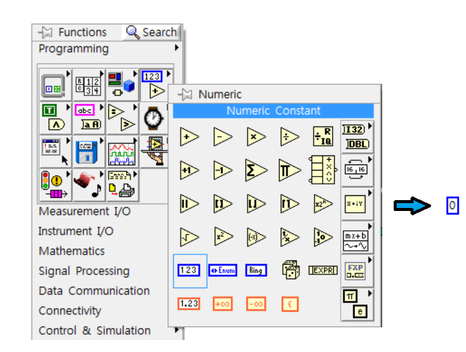
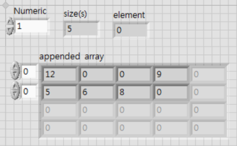
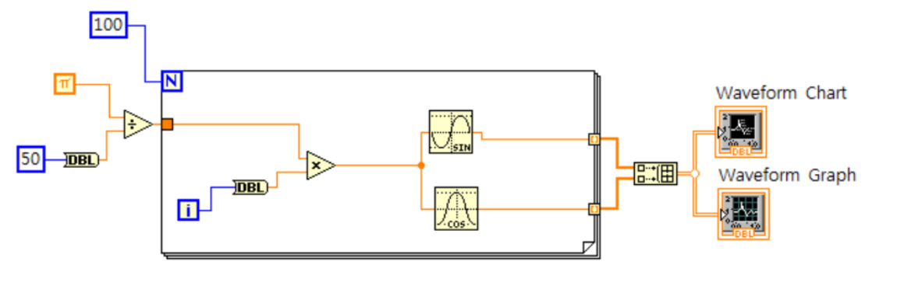
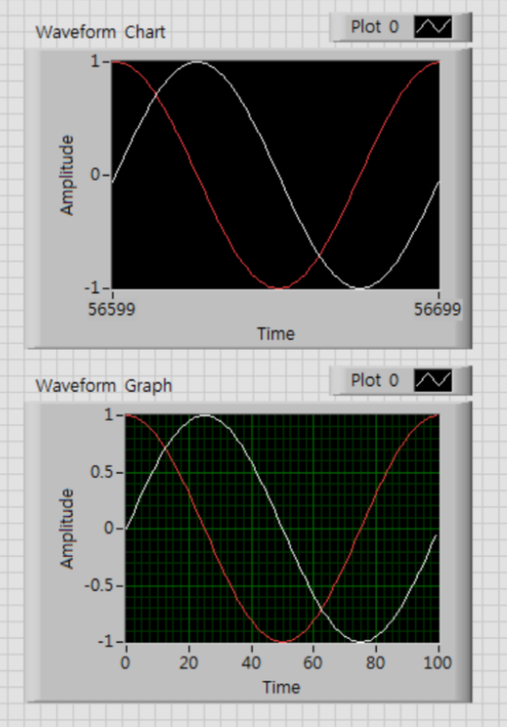

Title: LabVIEW-W2
Date: 2017-07-06 02:22
Category: LabVIEW
Tags: notes, LabVIEW
Slug: LabVIEW-W2
Author: 40423222

LabVIEW第二次上課紀錄

<!-- PELICAN_END_SUMMARY -->

<table border="5" width="100%" align="center">
<tr>
<td style="text-align:center" rowspan="5" bgcolor='#FFD78C'>Ctrl +</td>
<td style="text-align:left"">A: 全部選取</td>
<tr>
<td style="text-align:left">B: 去除(Block Diagram)錯誤的連接現</td>
<tr>
<td style="text-align:left">T: 將兩視窗(Front Panel and Block Diagram)對稱放置</td>
<tr>
<td style="text-align:left">Z: 回到上一步</td>
<tr>
<td style="text-align:left">左鍵案住移動: 可增加空白處</td>
<tr>
</table>
 
### 在空白處點兩下,可建立註解

### 基本說明:
 
正整數(Numeric)跟浮點數(DBL Numeric)
 
正整數: 沒小數點,例如: 12或0或112
 
浮點數: 有小數點,例如: 12.1234或0.124
 

 

 
.....................................................................................................................................................................
 
Constant跟Control
 
Constant: 只能在Block Diagram視窗控制,而且執行中不能進行更改
 
Control: 可在Fornt Panel視窗控制
 

 
.....................................................................................................................................................................
 
Control(輸出)跟Indicator(接收)
 
Control: 輸入數值
 
Indicator: 接收訊號

### 範例#1:
 

 

 
Array中文意思為矩陣
 
注意: 補上工具跟矩陣的名稱
 
Array Size工具顯示這Array有多大,例如: 矩陣12/0/3/9/6,顯示出的size(s)為5(五個數值)
 
矩陣左方能輸入數值,當數值是0時,代表從第0個數值開始顯示,也就是說,假如把矩陣12/0/3/9/6左方輸入1,他就會顯示0/3/9/6
 
Index Array工具是顯示第幾個的數值,例如: 輸入1,就會顯示第1個的數值,注意: 矩陣第一位的數值是以0表示
 
Build Array工具能融合數值,對他點擊右鍵可選擇別的融合方式
 
例如:
 

### 範例#2:
 

 

 
For Loop: 執行到要求的次數,才會停止
 
如果是While Loop要到設定條件才會停滯
 
在迴圈能使用Add Shift Register功能,當0加上1進入後方(上箭頭),指令會將這個1數值帶回去起始投(下箭頭),再跑N次(看你N輸入幾次)
 
注意: 要給初始值(左方連接0),才會會背上一次的紀錄給干擾
 
i為記錄For Loop的進行次數,在這範例N=9,也就是會跑9次,但是當For Loop跑完第一次時,i會以0數值記錄第一次迴圈,也就是跑完9次時i會顯示8,因為i是從0開始記錄(所以才要+1)

### 範例#3:
 

 

 
將For Loop內再放入For Loop,外圈的For跑第一次內部的For就要跑完九次,因為For的定義是內部程式跑完才在執行下一次,所以才會顯示出九九乘法表

### 範例#4:
 

 

 
DBL的功用是將正整數轉成浮點數,因為For Loop的i是以正整數顯示,要跟浮點數運算就需要DBL
 
所以圖中的50(contant),把它改成福點數就可以不用接上DBL
 
### Waveform:
 
Chart: 在接收到新訊息,會跟舊訊起顯示,不斷地連續下去(注意: 是有儲存限制,能去設定更改)
 
Graph: 在接收到新訊息,會直接刷新,不會跟舊訊息連續
 
注意: 可比對Time的數量