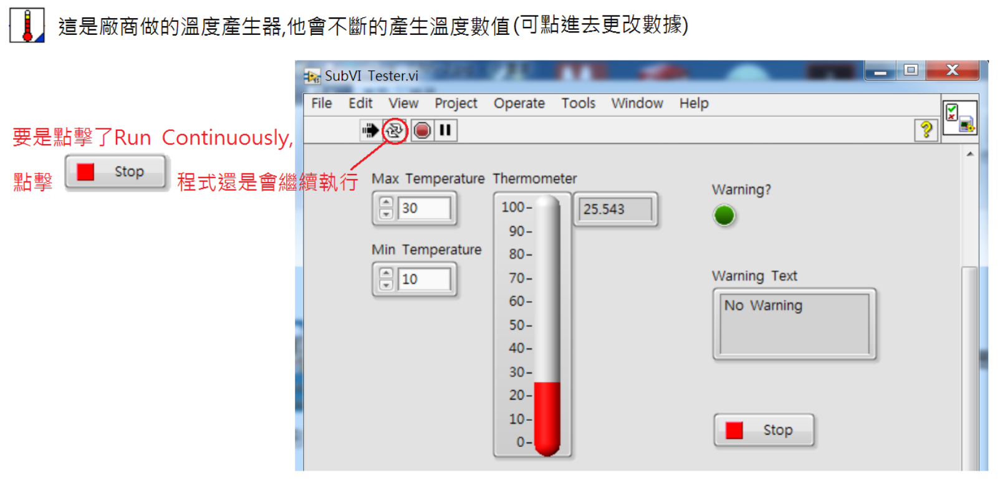

Title: LabVIEW-W3
Date: 2017-07-07 04:54
Category: LabVIEW
Tags: notes, LabVIEW
Slug: LabVIEW-W3
Author: 40423222

LabVIEW第三次上課紀錄

<!-- PELICAN_END_SUMMARY -->

### vi轉成縮圖:
 

 

### 範例:

 

### Max值 > Min值:

### 迴圈同步:

 

### Stopwatch:

### Cluster:

### Cluster-Make Type Def:

 

 
<table border="5" width="100%" align="center">
<tr>
<td style="text-align:center"  bgcolor='#FFD78C'>Cluster-Make Type Def</td>
<tr>
<td style="text-align:left"">Control: 更改後與Front Panel不會同步</td>
<tr>
<td style="text-align:left">Type Def: 更改後與Front Panel格式同步,但圖片不同步</td>
<tr>
<td style="text-align:left">Strict Type Def: 更改後與Front Panel完全同步</td>
<tr>
</table>