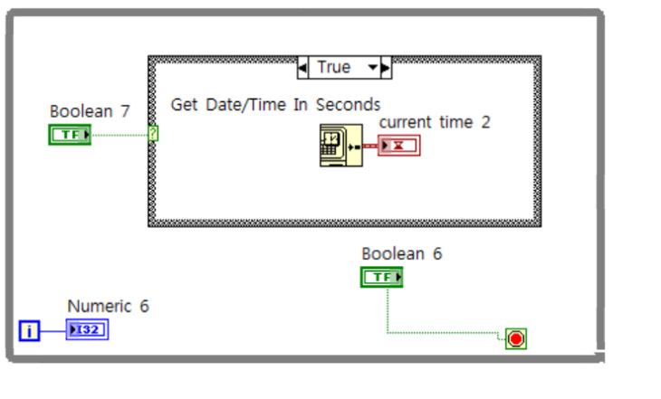
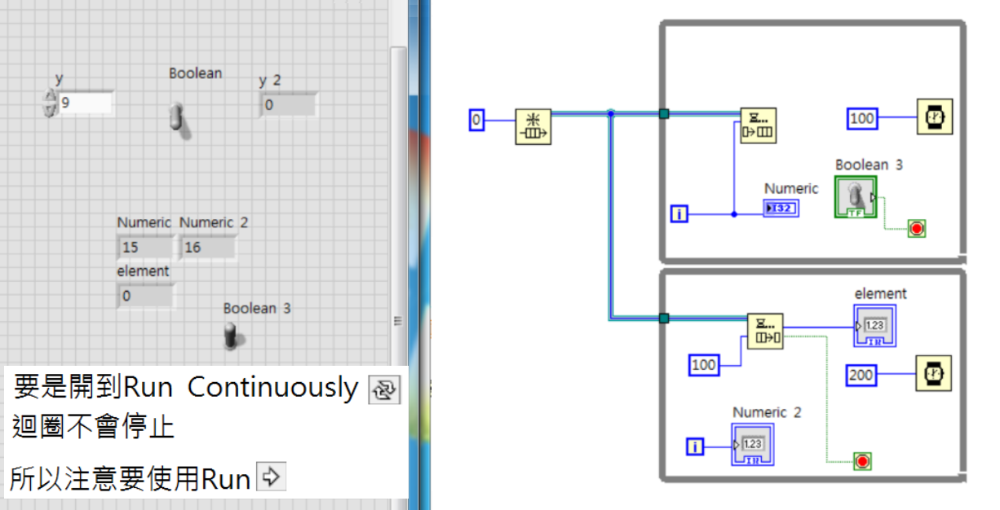
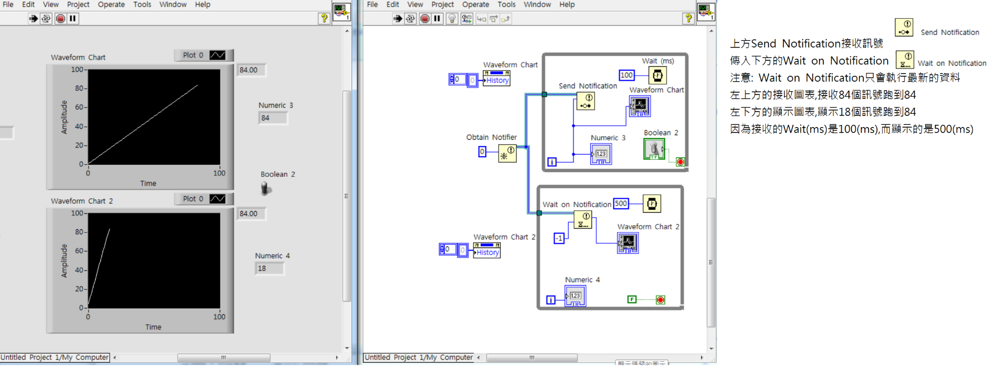

Title: LabVIEW-W4
Date: 2017-07-10 10:23
Category: LabVIEW
Tags: notes, LabVIEW
Slug: LabVIEW-W4
Author: 40423222

LabVIEW第四次上課紀錄

<!-- PELICAN_END_SUMMARY -->

### 時間顯示:
#### Example#1:

 
#### Example#2:

 

### 資料處裡#1:

### I and U:

### 資料處裡#2:

### 刷新Waveform:
